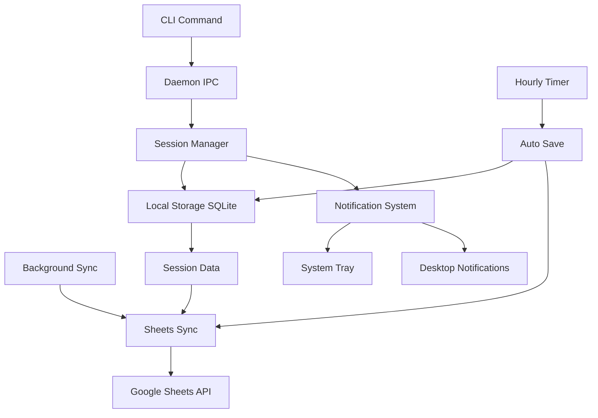

# Craftie - Go Craft Time Tracking Service

## System Architecture Overview

Craftie is a background service written in Go that tracks craft time sessions with Google Sheets integration and desktop notifications.

## Core Components

### 1. CLI Interface (`cmd/craftie/`)

- **Purpose**: User-facing command interface
- **Commands**:
  - `craftie start [project] [notes]` - Start new session
  - `craftie stop` - Stop current session
  - `craftie status` - Show current session status
  - `craftie exit` - Shutdown daemon
- **Implementation**: Uses Cobra CLI framework

### 2. Daemon Service (`internal/daemon/`)

- **Purpose**: Background service management
- **Features**:
  - Single instance enforcement (PID file)
  - IPC communication with CLI (Unix socket/Named pipe)
  - Graceful shutdown handling
  - Auto-start on system boot capability

### 3. Session Manager (`internal/session/`)

- **Purpose**: Core session tracking logic
- **Responsibilities**:
  - Start/stop session management
  - Duration calculation
  - Session state persistence
  - Automatic session stopping when new one starts

### 4. Local Storage (`internal/storage/`)

- **Purpose**: SQLite-based local data persistence
- **Schema**:
  ```sql
  CREATE TABLE sessions (
    id INTEGER PRIMARY KEY AUTOINCREMENT,
    start_time DATETIME NOT NULL,
    end_time DATETIME,
    duration INTEGER, -- seconds
    project_name TEXT,
    notes TEXT,
    synced_to_sheets BOOLEAN DEFAULT FALSE,
    created_at DATETIME DEFAULT CURRENT_TIMESTAMP
  );
  ```

### 5. Google Sheets Integration (`internal/sheets/`)

- **Purpose**: Sync data to Google Sheets
- **Authentication**: Service Account with JSON credentials
- **Sheet Format**:
  - Column A: Timestamp (RFC3339)
  - Column B: Duration (HH:MM:SS format)
  - Column C: Project/Task Name
  - Column D: Notes
- **Features**:
  - Batch upload of unsynced sessions
  - Retry logic with exponential backoff
  - Network failure resilience

### 6. Notification System (`internal/notifications/`)

- **Purpose**: Desktop notifications via system tray
- **Features**:
  - Hourly reminder notifications
  - Session start/stop confirmations
  - System tray icon with status
  - Cross-platform support (Linux, Windows, macOS)

### 7. Configuration (`internal/config/`)

- **Purpose**: Application configuration management
- **Config File**: `~/.craftie/config.yaml`
- **Settings**:

  ```yaml
  google_sheets:
    credentials_file: "~/.craftie/service-account.json"
    spreadsheet_id: "your-sheet-id"
    sheet_name: "CraftTime"

  notifications:
    enabled: true
    reminder_interval: "1h"
    show_tray_icon: true

  storage:
    database_path: "~/.craftie/sessions.db"

  daemon:
    socket_path: "~/.craftie/daemon.sock"
    pid_file: "~/.craftie/craftie.pid"
  ```

## Data Flow Architecture



## Process Flow

### Starting a Session

1. User runs `craftie start "Project Name" "Optional notes"`
2. CLI sends command to daemon via IPC
3. Daemon checks for existing active session
4. If active session exists, automatically stops it
5. Creates new session record in SQLite
6. Starts hourly timer for auto-save
7. Shows desktop notification confirming start
8. Updates system tray icon status

### Hourly Auto-Save

1. Timer triggers every hour
2. Updates current session duration in SQLite
3. Attempts to sync unsynced sessions to Google Sheets
4. Shows reminder notification
5. Continues session tracking

### Stopping a Session

1. User runs `craftie stop`
2. CLI sends stop command to daemon
3. Daemon calculates final duration
4. Updates session record with end time
5. Attempts immediate sync to Google Sheets
6. Shows completion notification
7. Updates system tray status

### Background Sync

1. Runs every 15 minutes
2. Queries unsynced sessions from SQLite
3. Batches and uploads to Google Sheets
4. Marks successfully synced sessions
5. Retries failed uploads with exponential backoff

## Technical Stack

### Core Dependencies

- **CLI Framework**: `github.com/spf13/cobra`
- **Configuration**: `github.com/spf13/viper`
- **Database**: `github.com/mattn/go-sqlite3`
- **Google Sheets**: `google.golang.org/api/sheets/v4`
- **System Tray**: `github.com/getlantern/systray`
- **Notifications**: `github.com/gen2brain/beeep`
- **Logging**: `github.com/sirupsen/logrus`

### Project Structure

```
craftie/
├── cmd/
│   └── craftie/
│       └── main.go
├── internal/
│   ├── daemon/
│   │   ├── daemon.go
│   │   └── ipc.go
│   ├── session/
│   │   ├── manager.go
│   │   └── timer.go
│   ├── storage/
│   │   ├── sqlite.go
│   │   └── models.go
│   ├── sheets/
│   │   ├── client.go
│   │   └── sync.go
│   ├── notifications/
│   │   ├── tray.go
│   │   └── desktop.go
│   └── config/
│       └── config.go
├── pkg/
│   └── types/
│       └── session.go
├── scripts/
│   ├── install.sh
│   └── service/
│       ├── craftie.service (systemd)
│       └── craftie.plist (macOS)
├── docs/
│   ├── setup.md
│   └── usage.md
├── go.mod
├── go.sum
├── Makefile
└── README.md
```

## Security Considerations

1. **Credentials Storage**: Service account JSON stored with restricted permissions (600)
2. **IPC Security**: Unix socket with user-only access
3. **PID File**: Prevents multiple daemon instances
4. **Data Encryption**: Consider encrypting local SQLite database
5. **API Rate Limits**: Respect Google Sheets API quotas

## Error Handling Strategy

1. **Network Failures**: Queue operations locally, retry with backoff
2. **Google API Errors**: Log errors, continue local tracking
3. **Database Errors**: Graceful degradation, file-based fallback
4. **Daemon Crashes**: Auto-restart capability via system service
5. **Invalid Commands**: Clear error messages to user

## Performance Considerations

1. **Database Indexing**: Index on timestamps and sync status
2. **Batch Operations**: Group Sheets API calls
3. **Memory Usage**: Minimal daemon footprint
4. **Startup Time**: Fast daemon initialization
5. **Resource Cleanup**: Proper goroutine and connection management
